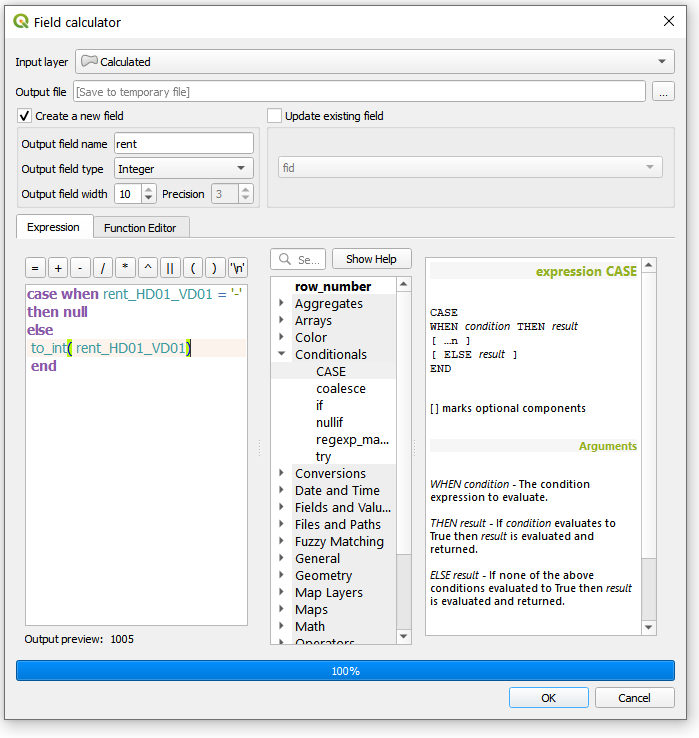
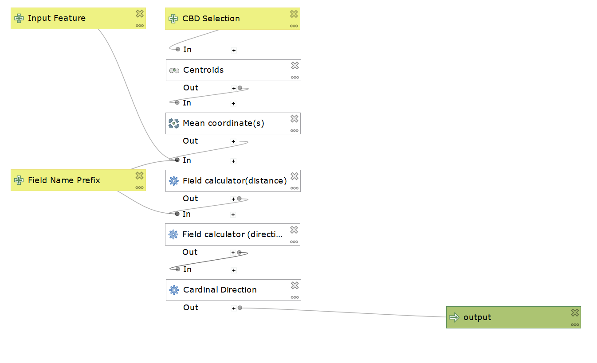
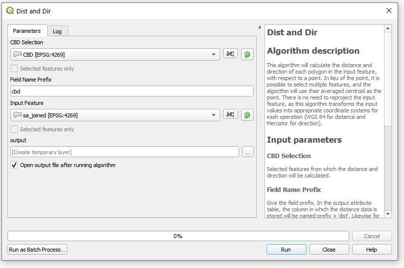
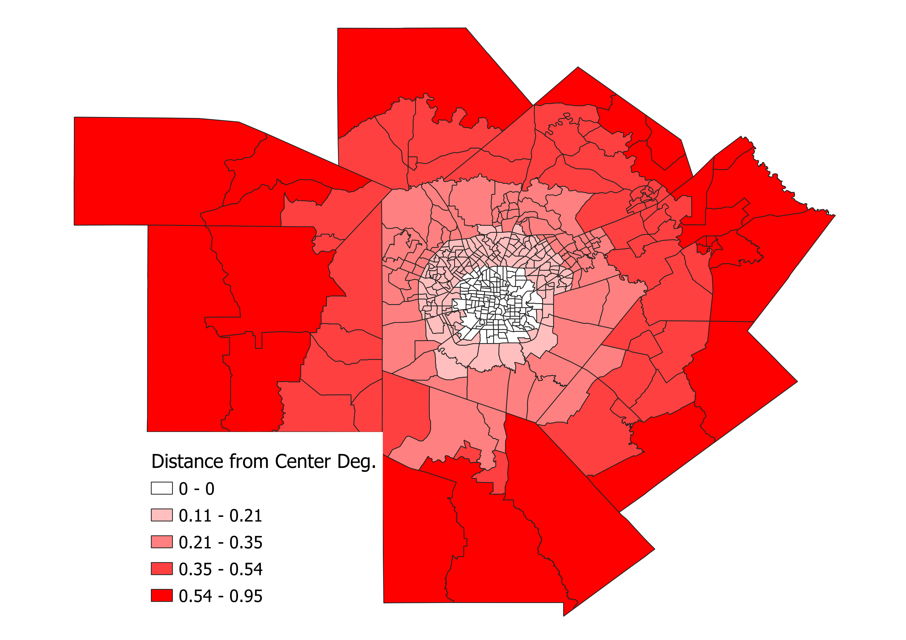
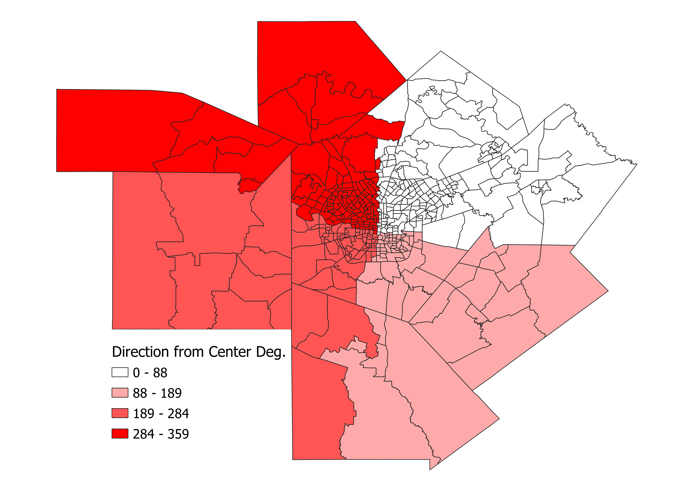
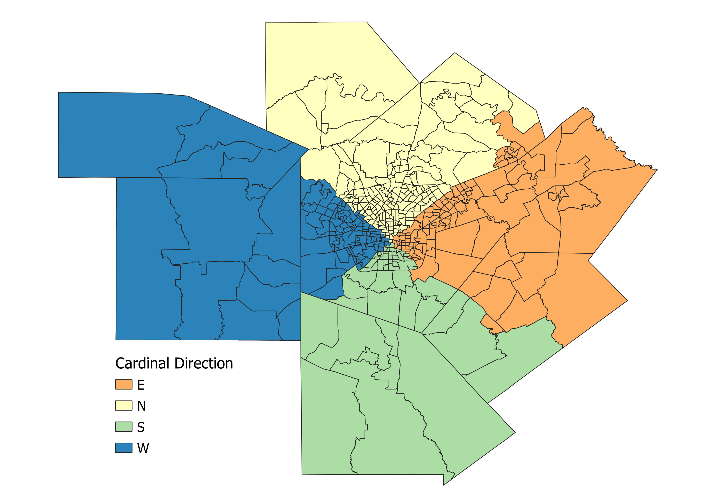
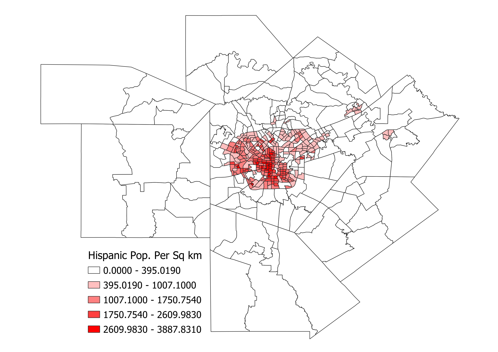
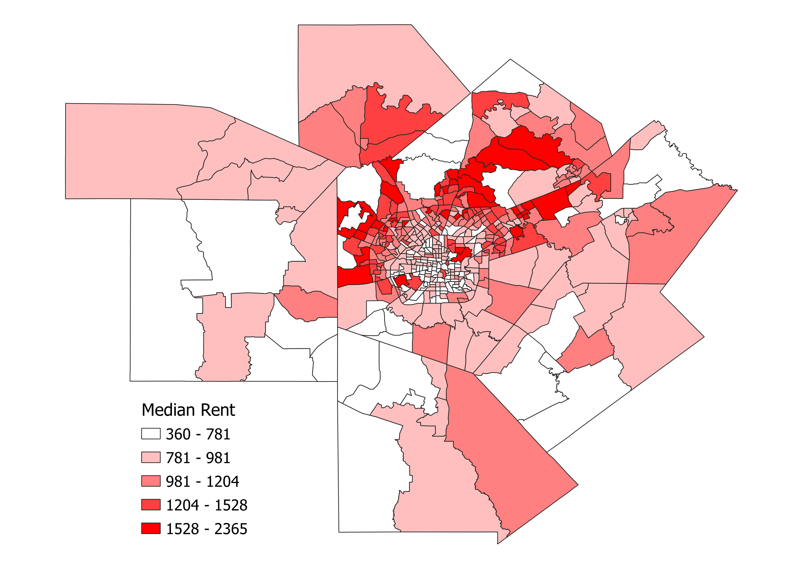

# Creating a QGIS Model: Introduction to Open Source

## Table of Contents
1. [Objective](#goal)
2. [Software and Documentation](#sw)
3. [The Distance and Direction QGIS Model](#model)
    1. [Obtaining Data](#model-a)
    2. [Understanding the Model](#model-b)
    3. [Outputs](#model-c)
    4. [Plotting Results in DataPlotly](#model-d)
    5. [Room for Future Work](#model-e)
4. [Discussion](#disc)

## Objective 

The goal of this lab is to be acquainted with the open source GIS environment; this can mean several things. In a myopic sense, this means learning to use QGIS, an open source GIS software. However, ‘open source’ is so much more than the software per se: it signifies the whole ecosystem of professionals and hobbyists that engage in the bottom up, grassroots creation of useful tools. This environment revolves around online forums and repositories like Github. Therefore, getting acquainted with open source means creating a tool, publishing it on the web, and creating helpful documentation to allow others to use and modify it. This is precisely the goal of this lab.   

## Software and Documentation 

### Software used

- [QGIS 3.8.1](https://www.qgis.org/en/site/)
- [DataPlotly 2.3](https://github.com/ghtmtt/DataPlotly)

### Documentation Referenced
- Lab Instructions by Professor Holler: [request document by email](mailto:jholler@middlebury.edu)
#### Works cited
- Rey, Sergio J. “Show Me the Code: Spatial Analysis and Open Source.” Journal of Geographical Systems, vol. 11, no. 2, 2009, pp. 191–207. EBSCOhost, doi:https://link.springer.com/journal/volumesAndIssues/10109.

## The Distance and Direction QGIS Model 

My model was designed to be used in urban geography analysis: there exists many theories like the distance-decay model that conceptualize the urban space as being organized radially out from the central business district. So, I made a tool that calculates the distance and direction with respect to the central business district for each polygon in the input shapefile. (Although you might find other uses too!)
- Download the model [here](dist_dir.model3)

### The Input 

The most appropriate input for this model would be a shapefile of an urban area at the census-tract level. Tract level shapefiles can be easily found through the US census [website](https://www.census.gov/geographies/mapping-files/time-series/geo/carto-boundary-file.html). I was interested in San Antonio, so I downloaded the data for the whole of Texas. The attribute table of the shapefile only contains basic information like the tract id, state id, land area etc. so we must populate it with data we are interested in. We can find census attribute data easily through [American Fact Finder]( https://factfinder.census.gov/).

In the “Advanced Search” section, we can set the geographies to census tracts, and chose a state or counties. I chose to download the data for the 8 counties that make up the Greater San Antonio Metropolitan Area. I was interested in median rent and Hispanic population, so I chose to download tables `B25064` and `B03002` from the 2017 ACS 5-year estimate dataset. Of course, you may choose any other tables depending on your analysis.

Now that we have all the data, let us open QGIS. (The csv file should be imported through `Layer -> Add Layer -> Add Delimited Text Layer`) We will select only the San Antonio counties from the shapefile and export to new layer, then join the rent and Hispanic values to the tracts using appropriate columns (GEOID). Important consideration here is that the census reports numbers as a string, so it is necessary to create integer columns for both data, and perform raster calculator to fill these columns.

If you would like to test my model without going through these steps, you may download the San Antonio shapefile already populated with data [here](sa_joined.shp)

### Understanding the Model 

The model I made is straight forward. It asks for two inputs features: the census tracts and central business districs. The CBD can be any type of geometry, even multiple features. The `Centroids` function finds all of the centroids within the CBD and the `Mean coordinates` function averages them to create one point feature. Then, this is fed through the `Field calculator` to calculate the distance, direction, and cardinal direction for each census tract.

Using the model is very simple. Under `CBD selection`, you will choose the layer which contains your central business district. As I have mentioned, this can be a point, polygon, or multiple polygons. What you input in `Field Name Prefix` will show up in the output column. For example, your distance column will be named "'Field Name Prefix'+ dist". Finally, under `Input Feature`, chose the census tract file. You could choose to save the output by assigning a name in the `output` section, or chose to leave it empty and the model will create a temporary layer.

### Outputs 

Here are the outputs of the model:

Distance

Direction

  

Cardinal Direction

### Plotting Results in DataPlotly 

Using DataPlotly, an open source plugin to QGIS, graphing data is made very easy. The plugin uses [D3](https://d3js.org/), an opensource javascript based data visualization scheme, to create a html file that can be uploaded to the web. I made a distance and direction graph using the outputs of our QGIS model, and plotted the Hispanic population density, as well as median rent in San Antonio.

- [Distance Plot](distance.html)
- [Direction Plot](direction.html)

Take a look also at a more conventional choropleth plot of the two data. You can see that our distance and direction plots can reveal patterns that are more difficult to see in the choropleth visualization. For example, with the distance plot, the effects of urban decay and suburbanization are striking. There is a clear upward trend in rent from the inner city to the suburb.

Hispanic Population Density Choropleth

Median Rent Choropleth

### Room for Future Work 

In true open source fashion, I have decided to leave some space for future work. I have tried to convert the model to use SQL instead, but I could not get this to work. Converting the model to SQL gives us access to a whole world of useful PostgreSQL functions. SQL will most likely provide a solution to my second problem, which is that the distance is measured in the same unit as the projection, in degrees. I thought of converting it into meters through a simple multiplication. However, this will not produce accurate results since the WGS84 is based on an ellipsoid and the radius is different based on the position on the globe.

## Discussion 

As Sergio Rey claims, open source might be the only truly innovative concept in business that has appeared in the 21st century (2009). It is an ecosystem of innovation and product development where individuals create, share, and modify. Its closest analogue is the academic community where there exists the same culture around peer-review, collaboration, improvement and reputation. And as I have learned, to be a part of this culture of ‘openness’ is not an easy feat. My work had to be notated, each decision justified, and the process well-documented. The thoroughness with which one must complete a task so that someone, somewhere can pick up the pieces later is quite daunting.

Rey also discusses some of the disadvantages of opensource, namely the inaccessibility for those less technically skilled. This I can admit I have experienced while working on this project. Opensource software is a patch work of code by difference people, including other opensource software. In the case of QGIS, it relies on SpatialLite for geodatabase functionality. DataPlotly runs on D3. If anything should go wrong, it can be very difficult for entry level users to find the appropriate help documentation. In my case, I could not find a way to have my model output distance in meters. One must be resourceful and modify codes from online forums to patch the problems that one encounters.

However, the advantages are also numerous. For example, people approach opensource software with a different mindset than they do a proprietary one. As Rey discusses, the user of proprietary software is often bounded by the functionality of the software, and they forget to think beyond the existing capabilities. On the other hand, the trajectory of opensource software is driven by the needs of the user. So, they work in quite the opposite way where the imagination of the user drives opensource innovation, whereas the functionality of proprietary software bounds the imagination. A great example of this was the direction plot in DataPlotly. In math and in geography, polar graphs are drawn differently, and the DataPlotly plugin only supported the math version of the graph (measured counterclockwise from the positive x-axis). A direction plot plotted in this way, however is not too useful in geography research. We could have easily abandoned the direction plot altogether, but our professor Joe Holler made small modifications to the code which gave the user an option between these two polar plots (it later became part of the plugin). This lab, although small in scope, was a great first step into the world of opensource.
