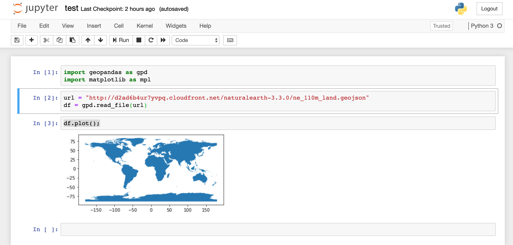

# GeoPandas and Data Management around Python

## Table of Contents

1. [Objective](#goal)
2. [Software and Documentation](#sw)
3. [Getting started with python](#pyt)

## Objective <a name="goal"></a>
 
This objective of this project is more learning oriented. I will learn how to use 

## Software and Documentation <a name="sw"></a>

### Software and modules used

- [Anaconda 2019.10 Python 3.7 Version](https://www.anaconda.com/distribution/) 
- [Python 3.6.7](https://www.python.org/)
- [GeoPandas 0.6.2](https://geopandas.readthedocs.io/en/latest/install.html)
- [Matplotlib 3.1.2](https://matplotlib.org/)
- [Jupyter 5.3.3](https://jupyter.org/)
- And all other dependencies. 
  
### Documentation Referenced

- [A helpful youtube tutorial](https://www.youtube.com/watch?v=slqZVgB8tIg&t=253s)
- spatialreference.org 

#### Works cited


## Getting started with python  <a name="pyt"></a>
The python software ecosystem is vast and complicated and it can be overwhelming at first. Here is a quick guide to all you should know. 
### Installing Anaconda 

Due to the complexity of the python environment, there exists dedicated software to manage workspace environments. In this project, I will be using the most common one, the free and opensource Anaconda. Anaconda is a great platform for managing ‘packages’. Most python tools, GeoPandas included, have ‘dependencies’ i.e. other modules on which it is dependent to run at all. Finding and installing each of these modules is a pain, but Anaconda automates this process. In addition, Anaconda facilitates the creation and maintenance of ‘environments’. It is recommended to create separate environments for each project, because projects could require different versions of the same module (or even python itself). Once Anaconda is installed, it will be accessible by its navigator software or through command-line.

### Setting up environment
To create an environment for GeoPandas, I used the following command that I borrowed from GeoPandas [installation guide](https://geopandas.readthedocs.io/en/latest/install.html). 

``` 
conda create -n geo_env
conda activate geo_env
conda config --env --add channels conda-forge
conda config --env --set channel_priority strict
conda install python=3 geopandas

``` 
Insert Image

### Installing other modules

Let us install the other packages. To do this through command-line, first type in the following to load the environment. Any command from this point will be executed within the environment. 

```
conda activate geo_env
``` 

We will now install Jupyter and Matplotlib. Jupyter is a platform that integrates a file browser, live python code, and visual outputs into a format called a notebook. It is much more user-friendly than a command-line terminal, and it facilitates file organization as well. Matplotlib will be used later to output the analysis onto a map. 

```
conda install matplotlib
conda install jupyter
```


