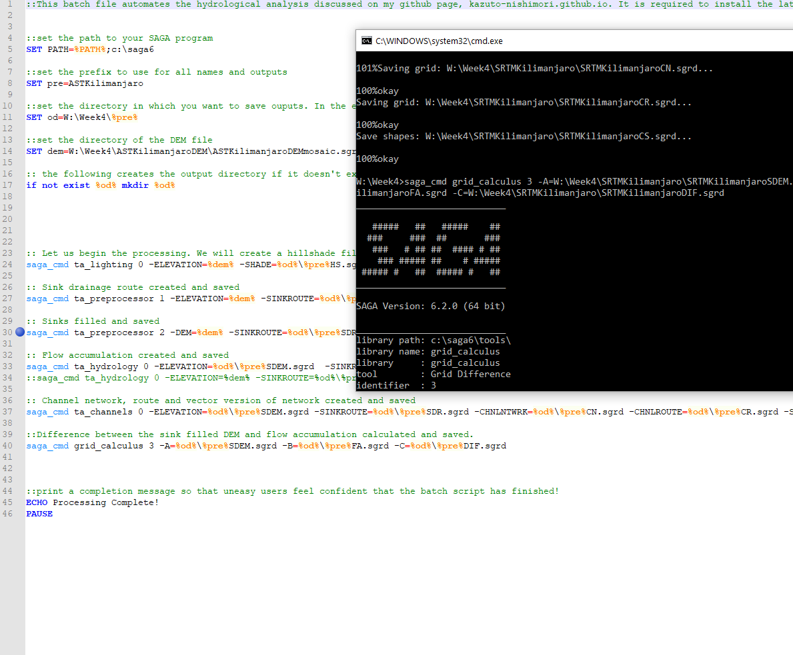
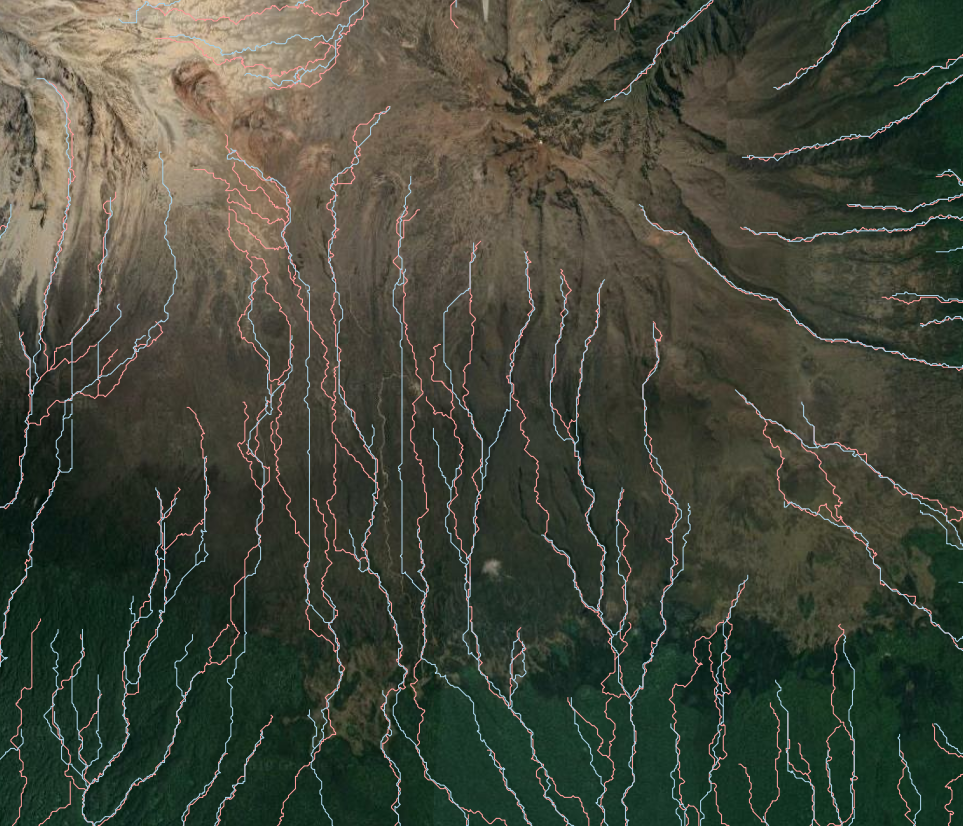

# Global DEM and Error Propagation 

## Table of Contents

1. [Objective](#goal)
2. [Software and Documentation](#sw)
3. [ollecting and Preparing Data](#data)
    1. [NASA](#data-a)
    2. [Preparing Rasters in SAGA](#data-b)
    3. [Extracting precise geographies](#rs-c)
    4. [Network analysis](#rs-d)
    5. [Text analysis](#rs-e)
    6. [Spatial analysis](#rs-f)
    
4. [Getting Started with twitter API](#twit)
    1. [Creating developer account ](#twit-a)
    2. [Important considerations with twitter data](#twit-b)
5. [Learning rStudio](#rs)
    1. [Setting up the environment](#rs-a)
    2. [Temporal analysis](#rs-b)
    3. [Extracting precise geographies](#rs-c)
    4. [Network analysis](#rs-d)
    5. [Text analysis](#rs-e)
    6. [Spatial analysis](#rs-f)
    7. [Uploading results to PostGIS for further spatial analysis](#rs-g)
4. [Twitter Activity during Hurricane Dorian](#dor)
    1. [Conceptual rationale](#malc-a)
    2. [Methodology](#malc-b)

## Objective 
The goal of this lab is 

## Software and Documentation 

### Software used

- [SAGA 6.2](https://www.qgis.org/en/site/) 
- [Python]

  

### Documentation Referenced
- Lab Instructions by Professor Holler: [request document by email](mailto:jholler@middlebury.edu)
- https://www.w3resource.com/

#### Works cited

This page will go over the very basics of terrain analysis using publicly availble NASA DEM data, as well as the open source software SAGA. [SAGA](http://www.saga-gis.org/en/index.html) been around since 2004, and it is a software ideal for physical geography analysis using raster data. 

## Collecting and Preparing Data 

### NASA Earthdata Portal 

The [NASA Earthdata Portal](https://search.earthdata.nasa.gov/search) is a great resource for downloading high resolution digital elevation models from anywhere in the world. It is free to use, but require an account. For this lab, we will be using Shuttle Radar Topography Mission (SRTM) 1 arcsecond dataset and looking at Mount Kilimanjaro in Tanzania. This data was obtained in a Space Shuttle mission, where during orbit, two radar sensors were placed at a significant distance apart to measure the elevation of the terrain from parallax. 1 arcsecond, i.e. 30 meters per pixel width, should provide the adequate definition for our project today. In the later sections, I will compare this SRTM dataset with another comparable dataset collected by a join US-Japanese satellite mission called the Aster Global DEM. We will explore the strengths and weakness of the datasets in the context of Mount Kilimanjaro. 

### Preparing Rasters in SAGA 

The dataset must be pre-processed before analysis. The raster data is imported into SAGA and opened in a map. If there are multiple rasters covering the area of interest, as is the case with mine, there will be an obvious discontinuity between the rasters when opened in the same map. Fortunately, this is (probably) not due to the dataset, but the representation of the data, as colors are assigned based on the relative highs and lows of each raster. To fix this, I will make a mosaic of the rasters `Tools -> Mosaicking`. Choose the bilinear interpolation for the sampling method, since this is a quantitative raster. I will chose the appropriate bounding box coordinates to crop my final mosaic. Lastly, I will reproject the layer to the correct UTM zone `Tools -> Projection -> Proj.4 -> UTM Projection (Grid)`.

Before Mosaic

After Mosaic

## SAGA Analysis

From here, all sorts of things are possible in SAGA. However, be sure to save the file before continuing, as SAGA can crash unexpectedly from time to time. 

### Hillshade

Hillshading is a great place to start, as it facilitates the visualisation of our data. `Tools -> Terrain Analysis -> Lighting, Visibility -> Analytical Hillshading`. Parameters should be modified as desired. One thing to note is that the default position of the sun is often at an angle that is physically impossible i.e. rays from the north in the northern hemisphere. Especially in fields such as cartography, it is important to make a conscious decision about the placement of the sun, whether to favor realism or legibility (the default setting looks natural to right-handed individuals who illuminate their desk from the upper left position).

### Sink drainage and removal

I will also try out a hydrological analysis. First, I run the sink drainage route tool to detect sinks and which direction water would flow upon encountering a sink `Tools -> Terrain Analysis -> Preprocessing -> Sink Drainage Route`. We then fill in these sinks using the sink removal tool `Tools -> Terrain Analysis -> Preprocessing -> Sink Removal`. 

This graphic can be helpful in understanding what sinks mean in an hydrological system. The sink removal tool outputs a new DEM with these sinks filled. 

### Flow accumulation 

Next, I will run the flow accumulation function `Tools -> Terrain Analysis -> Hydrology -> Flow Accumulation (Top-Down)`. This tool maps out, for each cell, how many cells contribute to its water flow. This is helpful in detecting where streams start and how they build up. 

### Channel Network 

Finally, a useful tool is the channel network tool that creates both a raster and vector representation of water channel. It can be exported to be used in other GIS software. `Tools -> Terrain Analysis -> Channels -> Chanel Network`

Update:

This week, I automated last week’s analysis with a Batch file to reproduce the output with different datasets. Automation is surprisingly straightforward, and can be broken up into 3 steps.

Firstly, we must set all appropriate directories so that the command module can find the SAGA commands, the input files, and output directory. Then, we add the tools to be executed. We could search for each tool in command line format from this [website](http://www.saga-gis.org/saga_tool_doc/7.4.0/index.html). Alternatively, right clicking on any tool in SAGA will reveal a ‘copy as command-line’ option that is usually more convenient, as it copies all relevant inputs. Then, the last step is to set up the appropriate inputs, outputs for each command, save and run!

Some helpful tips include using variables with the ‘set’ functions to minimize the number of times we need to type the input and output directories. In addition, when changing inputs or outputs, it is simple as changing the definition of the variable once. No need to go through each command to change each directory. 

I will link my [batch file](test.bat), as well as the [DEM file](ASTKilimanjaroDEMmosaic.sgrd) that I used in this example, so that you can experiment with your own computer. 

Since, I automated the process, I ran the same command using Aster and SRTM datasets to see if there are any significant differences in the outputs. And indeed, there were. An easy way to visualize the difference in DEM is to use the outputs from the Channel Network tool as it can be affected by small changes in elevation. The most striking difference I saw between the datasets was near the summit of Mt. Kilimanjaro. Here at high altitudes, SRTM seems to fail as the channel lines feature unnatural straight lines. 

Perhaps this difference at the peak is also due to the patchy data. Take a look at the NUM file below. The provenence of the data on the mountain is all over the place!. Compare that with a mostly seamless Aster data near the summit. In lower altitude areas, the two datasets match pretty well. 

