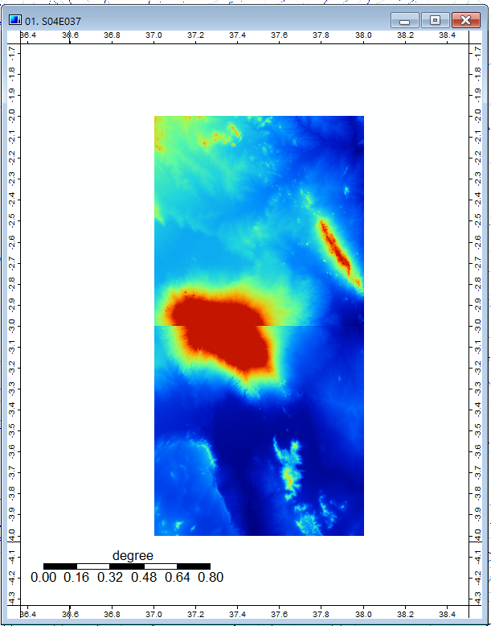
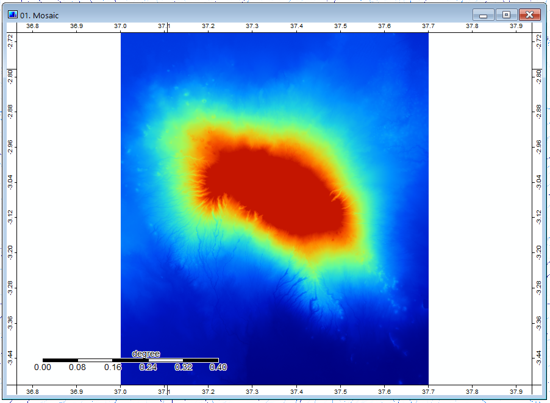
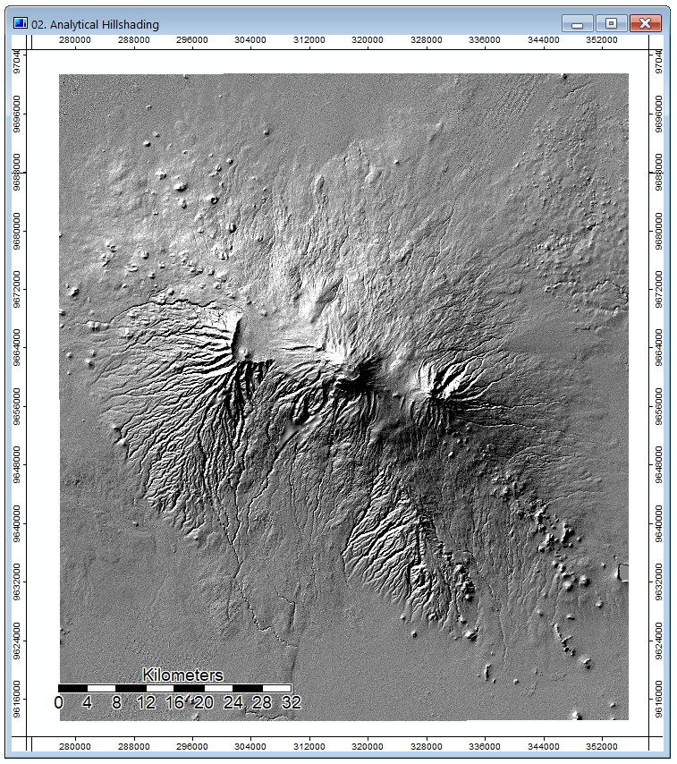
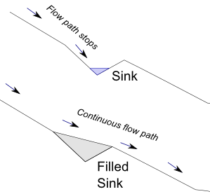
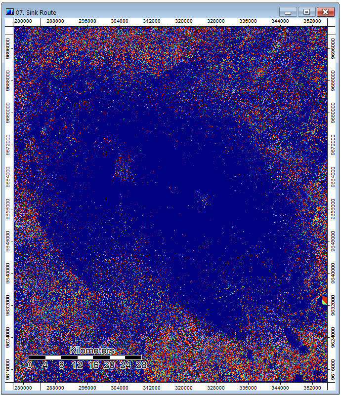
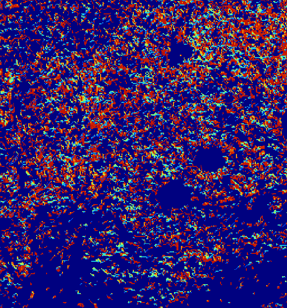
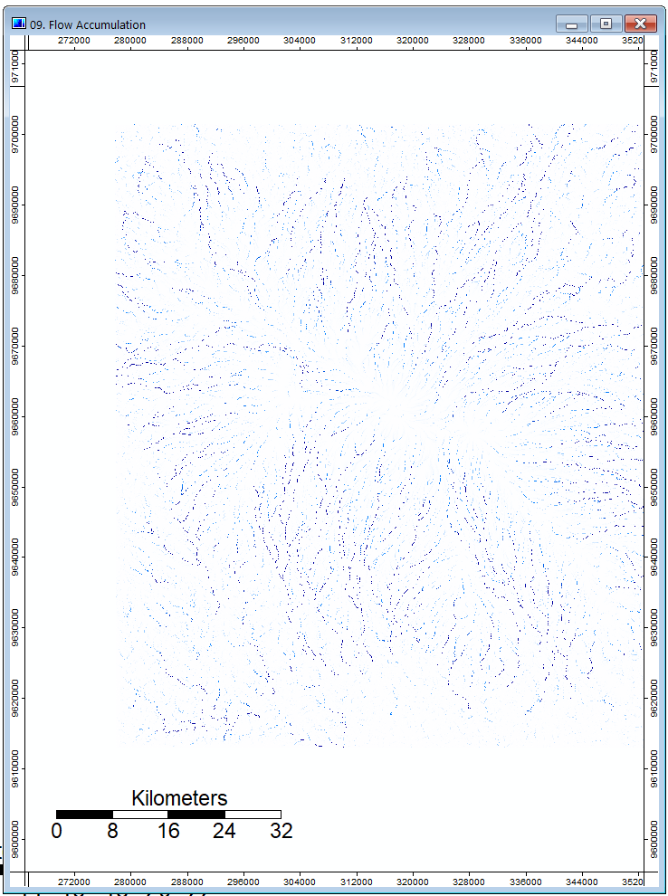
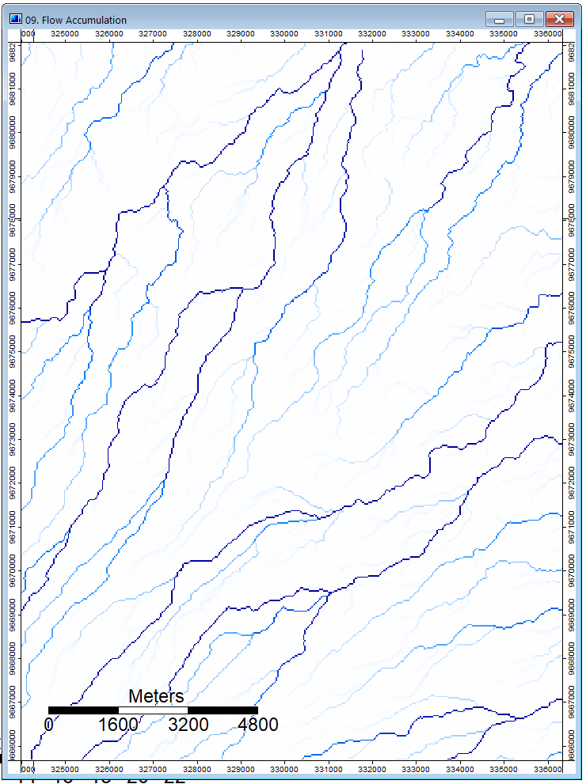
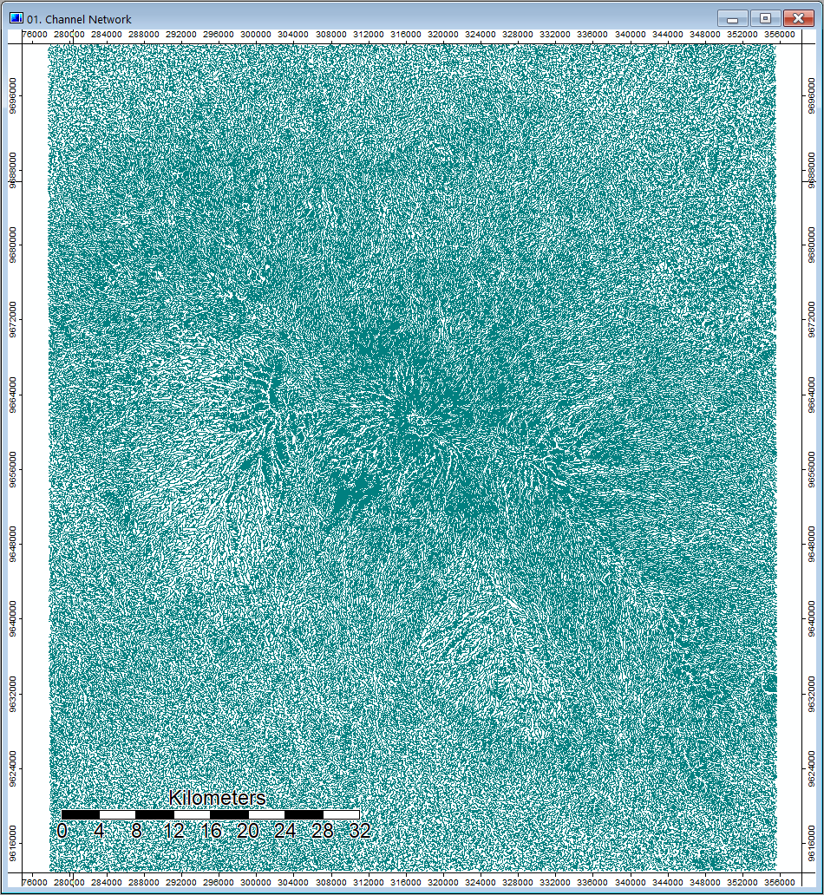
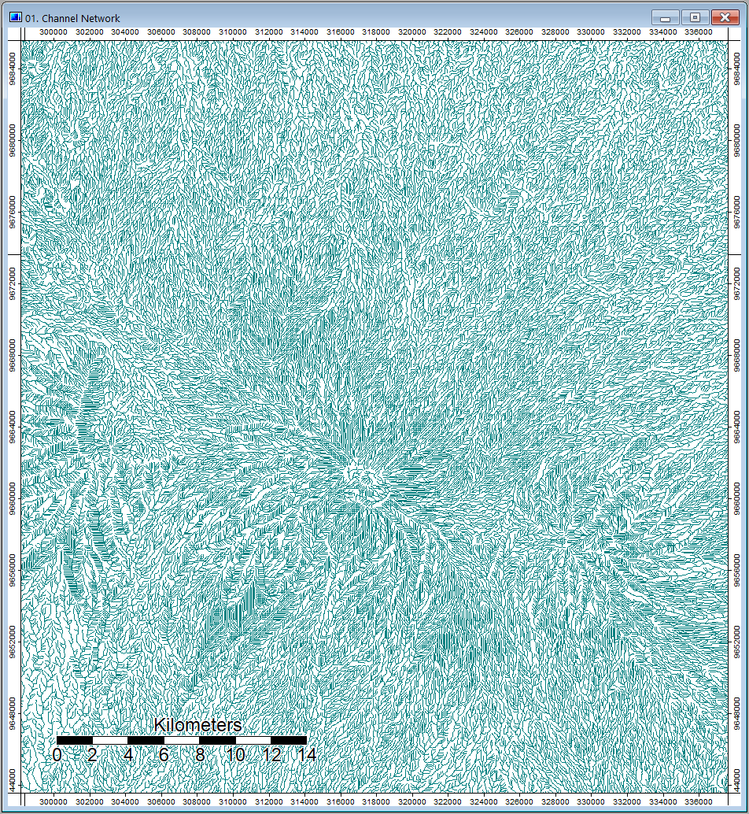

This page will go over the very basics of terrain analysis using publicly availble NASA DEM data, as well as the open source software SAGA. [SAGA](http://www.saga-gis.org/en/index.html) been around since 2004, and it is a software ideal for physical geography analysis using raster data. 

Firstly, let us collect data from the [NASA Earthdata portal](https://search.earthdata.nasa.gov/search). In the search box, we enter the type of data, in this case, I am opting for the Shuttle Radar Topography Mission (SRTM) 1 arcsecond dataset. This data was obtained in one of the Space Shuttle missions, where during orbit, two radar sensors were placed at a significant distance apart to measure the elevation of the terrain from parallax. 1 arcsecond, i.e. 30 meters per pixel width, should provide the adequate definition for our project today. Alternatively, the Aster Global DEM dataset collected by a join US-Japanese satellite mission is also useful.

We then prepare the dataset for analysis. The raster data is imported into SAGA and opened in a map. If there are multiple rasters covering the area of interest, as is the case with mine, there will be an obvious discontinuity between the rasters upon opening them in the same map. However, this is (probably) not due to the dataset, but the representation of the data, as colors are assigned based on the relative highs and lows of each raster. To fix this, we must make a mosaic of the rasters (Tools -> Mosaicking). Chose the bilinear interpolation for the sampling method, since this is a quantitative raster. I will chose the appropriate Left, Right, Top, and Bottom coordinates to crop my final mosaic. Lastly, we will reproject the layer to the correct UTM zone (Tools -> Projection -> Proj.4 -> UTM Projection (Grid)).

From here, all sorts of things are possible in SAGA. However, before continuing, be sure to save the file, as SAGA can crash unexpectedly from time to time. Hillshading is a great place to start, as it facilitates the visualisation of our data. (Tools -> Terrain Analysis -> Lighting, Visibility -> Analytical Hillshading). Parameters should be modified as desired. One thing to note is that the default position of the sun is often at an angle that is physically impossible i.e. rays from the north in the northern hemisphere. Especially in fields such as cartography, one must make a conscious decision about the placement of the sun, whether to favor realism or legibility (the default setting looks natural to right-handed individuals who often illuminate their desk from the upper left position).

We will also tryout a hydrological analysis. First, let us run the sink drainage route tool to detect sinks and which direction water would flow upon encountering a sink (Tools -> Terrain Analysis -> Preprocessing -> Sink Drainage Route). We then fill in these sinks using the sink removal tool (Tools -> Terrain Analysis -> Preprocessing -> Sink Removal). 

This graphic can be helpful in understanding sinks in an hydrological system. The sink removal tool fills in these sinks and gives us a new elevation model.

Next, we will try the flow accumulation model (Tools -> Terrain Analysis -> Hydrology -> Flow Accumulation (Top-Down)). This tool maps out, for each cell, how many cells contribute to its water flow. This is helpful in detecting where stream starts and how they build up. 

Finally, a useful tool is the channel network tool that creates both a raster and vector representation of these channels that we can export and use in other GIS software. (Tools -> Terrain Analysis -> Channels -> Chanel Network)

Update:

This week, I automated last week’s analysis with a Batch file to reproduce the output with different datasets. Automation is surprisingly straightforward, and can be broken up into 3 steps.

Firstly, we must set all appropriate directories so that the command module can find the SAGA commands, the input files, and output directory. Then, we add the tools to be executed. We could search for each tool in command line format from this [website](http://www.saga-gis.org/saga_tool_doc/7.4.0/index.html). Alternatively, right clicking on any tool in SAGA will reveal a ‘copy as command-line’ option that is usually more convenient, as it copies all relevant inputs. Then, the last step is to set up the appropriate inputs, outputs for each command, save and run!

Some helpful tips include using variables with the ‘set’ functions to minimize the number of times we need to type the input and output directories. In addition, when changing inputs or outputs, it is simple as changing the definition of the variable once. No need to go through each command to change each directory. 

I will link my [batch file](test.bat), as well as the [DEM file](ASTKilimanjaroDEMmosaic.sgrd) that I used in this example, so that you can experiment with your own computer. 

Since, I automated the process, I ran the same command using Aster and SRTM datasets to see if there are any significant differences in the outputs. And indeed, there were. An easy way to visualize the difference in DEM is to use the outputs from the Channel Network tool as it can be affected by small changes in elevation. The most striking difference I saw between the datasets was near the summit of Mt. Kilimanjaro. Here at high altitudes, SRTM seems to fail as the channel lines feature unnatural straight lines. 

Perhaps this difference at the peak is also due to the patchy data. Take a look at the NUM file below. The provenence of the data on the mountain is all over the place!. Compare that with a mostly seamless Aster data near the summit. In lower altitude areas, the two datasets match pretty well. 

Software:
SAGA 7.4
QGIS 3.8.3

Data:
NASA Open Data Portal 
