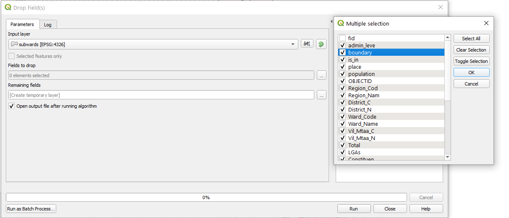
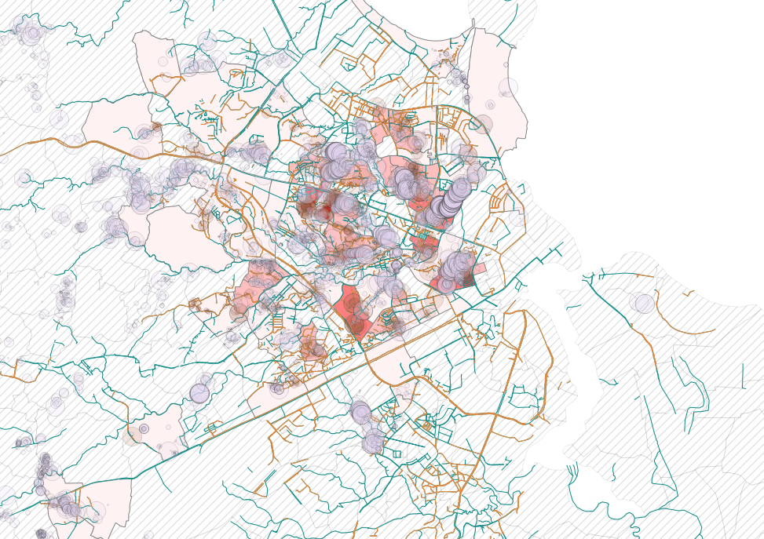
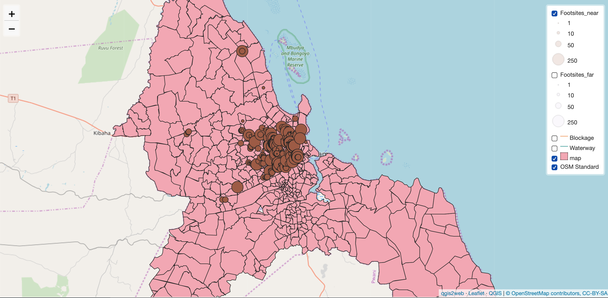

# Web Mapping with Leaflet

## Table of Contents
1. [Objective](#goal)
2. [Creating the layers](#crt)
    1. [Using drop fields](#crt-a)
    2. [Using SQL](#crt-b)
3. [Grooming the layers](#grm)
4. [Exporting to Leaflet](#exp)
5. [Problem with choropleth maps](#pro)
6. [Tweaking the html](#html)  
    1. [Changing the size of map](#html-a)
    2. [Modifying symbology](#html-b)    
    3. [Editing the legend](#html-c)
    4. [Editing the footer](#html-d)
7. [Final Product](#final)  

## Objective <a name="goal"></a>

Creating a 'slippy' webmap is very easy to do thanks to the myriad of opensource plugins and software that is available now. The two most popular are OpenLayers and Leaflet, which uses javascript files exported from QGIS layers to create a in-browser visualisation. The goal of this lab is to create this [webmap](qgis2web_2019_12_02-00_18_52_126796/index.html). The steps are straightforward, but bugs and glitches are rather common. I will walk you through how I made this webmap. 

## Creating the Layers to be Exported <a name="crt"></a>

Before we export anything to leaflet, we must make new layers that are stripped of all columns expect the bare minimum: the data that will be displayed. The reason is twofold. This minimizes the size of the file, making the viewing experience on the web browser smoother. In addition, unsecured JSON files can be downloaded and its data extracted; one could accidentally leak sensitive or licensed data on the web. For these reasons, it is important to minimize the attributes.

### Using drop fields <a name="crt-a"></a>
We can do this simply with the `Drop Fields` tool that can be found via the `Processing Toolbox`. It is as simple as clicking on the columns to drop. For the final output layer from last week’s lab, I will only preserve the unique fid and the normalized scores. Afterwards, it is necessary to export this new layer as a shape file to make it permanent.



### Using SQL <a name="crt-b"></a>
I decided that in addition to the output map, I wish to show the inaccessible waste sites as well as waterways and blockages. For the waste sites, there should be a distinction between sites within the buffer and sites outside. So, I must make four additional layers. A quick SQL line will do the job.

Waterway layer: Notice that I am only selecting the bare minimum. I decided to include the waterway column, which reveals the type of waterway, be it drain or river. In the final product, it will be nice to have the type of waterway popup when the cursor is hovered over the line feature.

``` sql
SELECT osm_id, way, waterway FROM planet_osm_line
WHERE waterway IS NOT NULL
```

Blockage:
``` sql
SELECT osm_id, way, waterway FROM planet_osm_line
WHERE waterway IS NOT NULL AND blockage IS NOT NULL AND blockage <> ’no’
```

Inaccessible waste site near blockage
``` sql
SELECT id, geom, trash_score FROM ws
WHERE access_typ = ‘Foot only’ AND trash_score IS NOT NULL and near_blockage IS TRUE
```

Inaccessible waste site not near blockage
``` sql
SELECT id, geom, trash_score FROM ws
WHERE access_typ = ‘Foot only’ AND trash_score IS NOT NULL and near_blockage IS FALSE
```

After each query, you must load the layer onto QGIS, export and save as a shape file like we did before.

## Grooming the Layers <a name="grm"></a>

Once the layers are exported to Leaflet, it is very difficult to change the appearance of the layers. It is still possible, but one must dig deep into the html file. So, it is smart to have the final visualization on the QGIS canvas before exporting. I used color schemes that are intuitive: hues of red connote danger, and blues do safety. I chose the colors to complement the red choropleth and based on the red/blue binary. The waste sites were scaled based on their score, and set at 15% opacity to highlight areas with many overlapping circles. The final visualization looks busy, but since users can toggle on and off the layers, I did not spend too much time perfecting it (as I would with print cartography). Lastly I added a OSM base map through `Web` -> `QuickMapServices` -> `OSM`. Now all layers are ready for export!


## Exporting the Layers to Leaflet <a name="exp"></a>

To export the layers, you must first install a plugin called QGIS2WEB. It is found with a quick search under `Plugins` -> `Manage and Install Plugins`. The new plugin is found under `Web` -> `QGIS2WEB` -> `Create Web Map`. This plugin automates the conversion of layers to JSON format and creates a html file.

Make sure to click on only the layers you need. For each layer, checking the `visible` box sets that layer to be visible upon opening the map. The `popup` box can be checked to allow users to see the values by hovering over the feature.

IMAGE HERE

Under `Add layers list`, chose `expanded` so that the legend is always visible. The max and min zoom levels restricts how close/far the user can zoom in. 19 and 6 respectively seem to work well for this extent.

IMAGE

Finally, chose a folder and export!

## Problem with Choropleth maps <a name="pro"></a>

I learned the hard way that there is a rather common glitch with QGIS2WEB when trying to export a choropleth map. I could not get past a ‘NONETYPE’ error when trying to export this map. I tried many different things, but it was impossible to circumvent this problem in a straight-forward way, and trying to fix the plug-in beyond the scope of this lab. Here is the bandage solution that I came up with.

IMAGE of error

I first exported the map but turned my choropleth map back into the original sub-ward map through symbology. I will edit the output file by transplanting code from a working leaflet choropleth map.



I looked at a html code of an existing choropleth [map]( https://gis4dev.github.io/leaflet_test/index.html) on leaflet made by my professor. I copied the entire block of code responsible for the choropleth layer onto notepad. I found and replaced every mention of the layer name with the name of my layer: ‘map_1’ using `ctrl + F`. I did the same for the feature name: ‘score_norm’. Of course, the bounds for the classification must be changed also. Finally, I changed the colors and opacity to the settings I had on the choropleth map in QGIS. The entire code can be found [here](test.html) but here is a snippet of what it looks like.

```
function style_map_1_0(feature) {

            if (feature.properties['score_norm'] >= 0 && feature.properties['score_norm'] <= 0.1 ) {
                return {
                pane: 'pane_map_1',
                opacity: .1,
                color: 'rgba(84, 84, 84, 1)',
                dashArray: '',
                lineCap: 'butt',
                lineJoin: 'miter',
                weight: 1,
                fill: true,
                fillOpacity: 0.1,
                fillColor: 'rgba(158, 158, 158, 1)',
                interactive: true,
            }
```

Lo and behold, the choropleth map finally worked. This does not fix the legend, but I did not bother to fix it. I made this choice because the values themselves, the normalized sum of trash scores, hold no significance. We are only interested in the hierarchy of the sub-wards’ vulnerability, which we do not need a legend to see.

## Tweaking the HTML <a name="html"></a>

### Changing the size of map <a name="html-a"></a>

Further edits must be made in the html file to optimize user experience. Firstly, I changed the size of the map, which by default has a width and height defined by a certain number pixels.  The css code is towards the top of the html file, around line 10. The style tags can be simply replaced by the latter so that the map fills up the entire browser window. Notice that the width and height are now dynamically defined by percentage of the window rather than the number of pixels.

```
<style>
        html, body, #map {
            width: 100%;
            height: 100%;
            padding: 0;
            margin: 0;
        }
</style>
```

### Modifying symbology <a name="html-b"></a>

During the export process, the opacity settings get lost. Therefore, it is necessary to change this through html as well. You will find style functions for each layer, and it is rather self-explanatory. The number following `opacity` and `fillOpacity` are respectively the opacities for the stroke and fill. For the waste site layer, I changed the two opacities to 0.15. Here, you can also do most things you can do under symbology such as swapping the color changing the radius of the dot.

```
function style_Footsites_near_4_0(feature) {
            switch(String(feature.properties['trash_scor'])) {
                case '1':
                    return {
                pane: 'pane_Footsites_near_4',
                radius: 1.0,
                opacity: .15,
                color: 'rgba(35,35,35,1.0)',
                dashArray: '',
                lineCap: 'butt',
                lineJoin: 'miter',
                weight: 1,
                fill: true,
                fillOpacity: .15,
                fillColor: 'rgba(158,91,66,1.0)',
                interactive: false,
            }
```

### Editing the legend <a name="html-c"></a>
Let us edit the text in the legend, since as of now it shows the name of the layer. The code for this is found at the bottom of the file in the function `L.control.layers`. I swapped `footsite_near` with the following. I added `<br>` tags to insert line breaks to preserve horizontal space.

```html
Sites accessible<br>only by foot,<br>near blockages
```

### Editing the footer <a name="html-d"></a>
The function `map.attributionControl.setPrefix()` contains the footer, and I added my name and a link to my Github page. I pasted the following line.

```html
<a href="https://kazuto-nishimori.github.com/" target="_blank">Cartography by Kazuto Nishimori</a>
```

## Final Product <a name="final"></a>
And voila! This is the [final product.](qgis2web_2019_12_02-00_18_52_126796/index.html)
